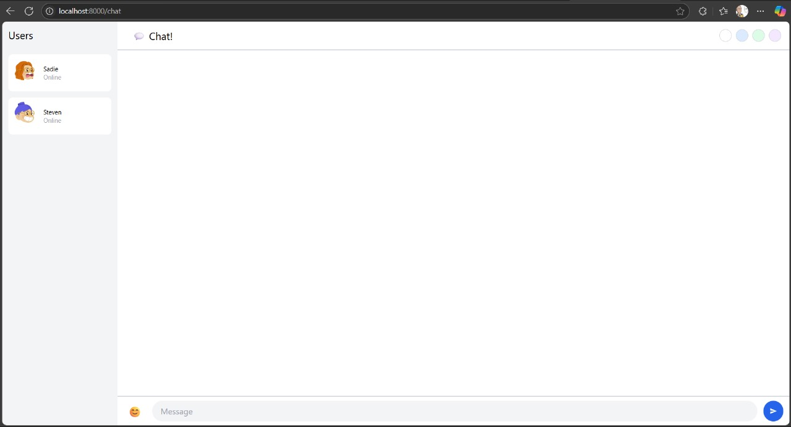

# Reflection

## Original Code

Setelah melakukan `git clone` pada repositori https://github.com/jtordgeman/YewChat/tree/websockets-part2 dan https://github.com/jtordgeman/SimpleWebsocketServer dan mengikuti tutorial yang diberikan, saya telah berhasil membuat sebuah _chat app_ dengan memanfaatkan _websocket_. Pada app ini, user akan diminta untuk memasukkan username terlebih dahulu, baru ia dapat berinteraksi dan berkomunikasi dengan orang lain pada _room chat_ tersebut.

## Be Creative

Pada commit ini, saya menambahkan beberapa fitur pada aplikasi YewChat ini, yaitu menambahkan pilihan profile pada menu login (terdapat 3 pilihan profile), kemudian ketika masuk ke dalam fitur chat, saya menambahkan fitur emoji serta _change theme_!